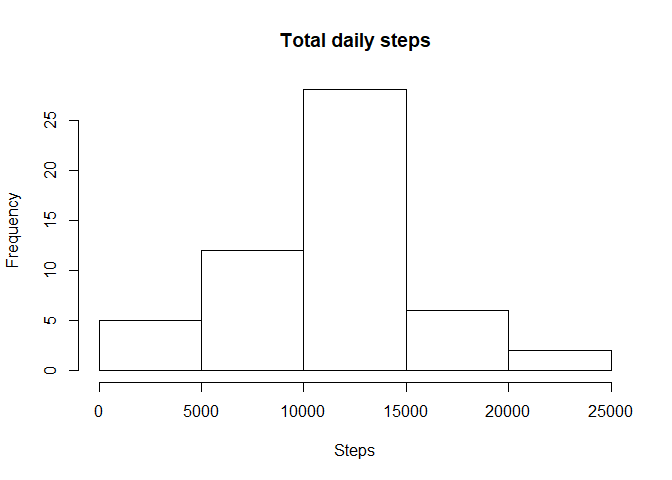
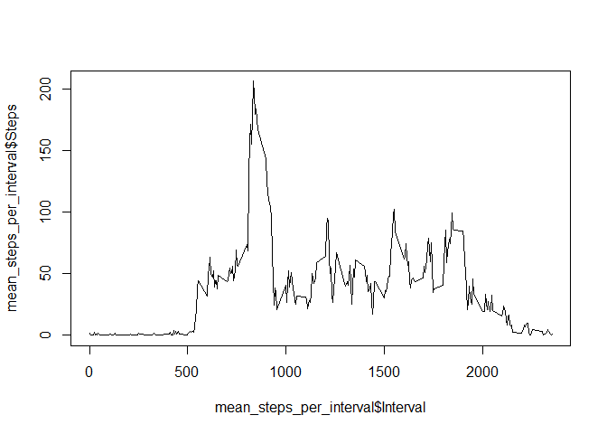
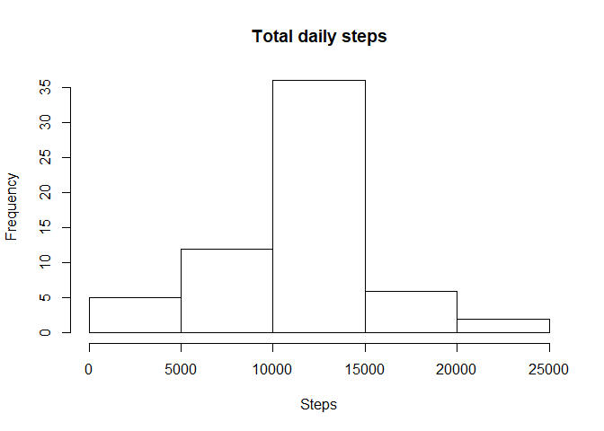
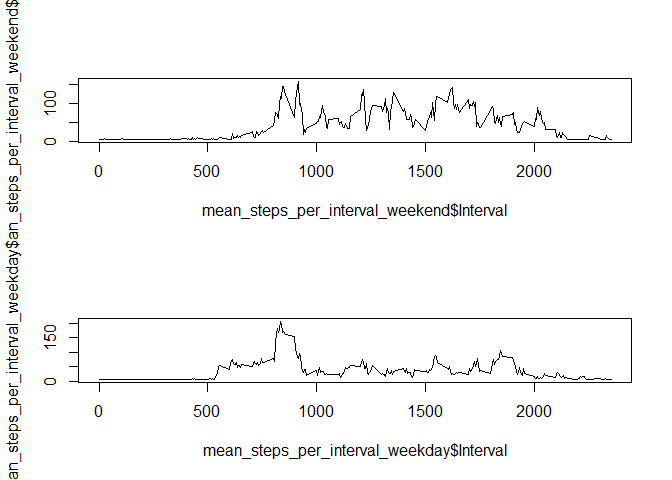

## Loading and preprocessing the data


```r
df <- read.csv("activity.csv")
df_rmna <- na.omit(df)
```

## What is mean total number of steps taken per day?


```r
steps_per_day <- aggregate(x=df_rmna$steps, by=list(df_rmna$date), sum)
names(steps_per_day) <- c("Date", "Steps")
hist(steps_per_day$Steps, xlab="Steps", main="Total daily steps")
```

<!-- -->

```r
mean(steps_per_day$Steps)
```

```
## [1] 10766.19
```

```r
median(steps_per_day$Steps)
```

```
## [1] 10765
```


## What is the average daily activity pattern?

```r
mean_steps_per_interval <- aggregate(x=df_rmna$steps, by=list(df_rmna$interval), mean)
names(mean_steps_per_interval) <- c("Interval", "Steps")

plot(mean_steps_per_interval$Interval, mean_steps_per_interval$Steps, type="l")
```

<!-- -->


## Imputing missing values

```r
sum(is.na(df$steps)==TRUE)
```

```
## [1] 2304
```

```r
#Impute with simple mean
df[is.na(df)] = mean(df$steps, na.rm=T)

#Imputed histogram
steps_per_day_imp <- aggregate(x=df$steps, by=list(df$date), sum)
names(steps_per_day_imp) <- c("Date", "Steps")
hist(steps_per_day_imp$Steps, xlab="Steps", main="Total daily steps")
```

<!-- -->

```r
#Imputed mean and median
mean(steps_per_day_imp$Steps)
```

```
## [1] 10766.19
```

```r
median(steps_per_day_imp$Steps)
```

```
## [1] 10766.19
```

## Are there differences in activity patterns between weekdays and weekends?

```r
df$weekday <-  ifelse(as.POSIXlt(df$date)$wday %in% c(0,6), 'weekend', 'weekday')
df_weekend <- subset(df, df$weekday=="weekend")
df_weekday <- subset(df, df$weekday=="weekday")

mean_steps_per_interval_weekend <- aggregate(x=df_weekend$steps, by=list(df_weekend$interval), mean)
names(mean_steps_per_interval_weekend) <- c("Interval", "Steps")

mean_steps_per_interval_weekday <- aggregate(x=df_weekday$steps, by=list(df_weekday$interval), mean)
names(mean_steps_per_interval_weekday) <- c("Interval", "Steps")
par(mfrow=c(2,1))
plot(mean_steps_per_interval_weekend$Interval, mean_steps_per_interval_weekend$Steps, type="l")
plot(mean_steps_per_interval_weekday$Interval, mean_steps_per_interval_weekday$Steps, type="l")
```

<!-- -->
